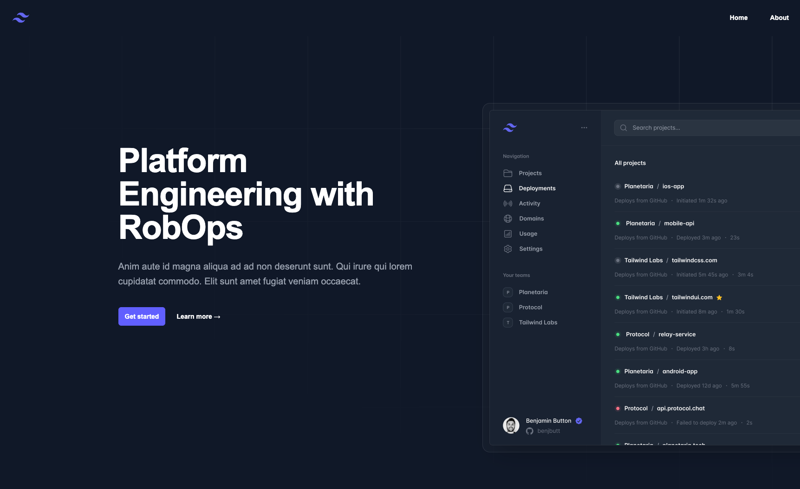

# Frontend from Scratch Series
This repository covers the frontend from scratch series from the RobOps Youtube channel. In this repository you will find the assets required to host a static webpage on AWS using Next.js and TailwindCSS.

## Table of Contents
- [About](#-about)
- [Getting Started](#-getting-started)
- [License](#-license)
- [Contacts](#%EF%B8%8F-contacts)

## 🚀 About
This repository is part of a multi-part series designed to show how you can create a frontend website from scratch.

Videos related to this repository can be found here:

## 🔥 Getting Started

To run the frontend locally, clone this repo and run the following commands:
npm install
npm run dev

## 📃 License 
As much as possible I'd like to encourage participation and collaboration. This code is open-source software licensed under [Apache 2.0 License](https://github.com/gowebly/gowebly/blob/main/LICENSE), created and supported by [Robert D'Ippolito](https://robertdippolito.me) for people and robots.

## 🗨️ Contacts
The best way to get in touch is via a Github issue or PR. You can also get in touch via my blog here: [https://robertdippolito.me](https://robertdippolito.me/)
